<p align="center">
  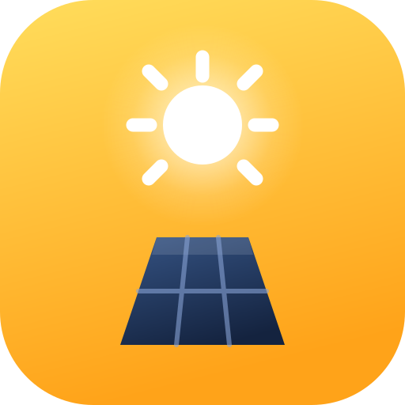
</p>

<h1 align="center">โซลาร์มอนิเตอร์ · Deye Solar Monitor</h1>

<p align="center">
  <b>แอปดูระบบโซลาร์เซลล์ Deye แบบเรียลไทม์ ภาษาไทย</b><br>
  ผลิตไฟ · ใช้ไฟ · แบตเตอรี่ · ซื้อ-ขายไฟ ครบในแอปเดียว — ติดตั้งเป็นแอปบนมือถือ รันฟรีบน Cloudflare ทุน <b>0 บาท</b>
</p>

<p align="center">
  <a href="https://github.com/botnick/deyecloud/actions/workflows/ci.yml"></a>
  
  
  
  
  
</p>

<p align="center">
  <a href="https://deploy.workers.cloudflare.com/?url=https://github.com/botnick/deyecloud"></a>
</p>

<p align="center">
  <a href="#ภาพหน้าจอ">ภาพหน้าจอ</a> ·
  <a href="#ฟีเจอร์">ฟีเจอร์</a> ·
  <a href="#ติดตั้ง-ฟรี">ติดตั้ง</a> ·
  <a href="#ตั้งค่า">ตั้งค่า</a> ·
  <a href="./ARCHITECTURE.md">สถาปัตยกรรม</a> ·
  <a href="./DEPLOY.md">คู่มือ deploy</a>
</p>

<p align="center">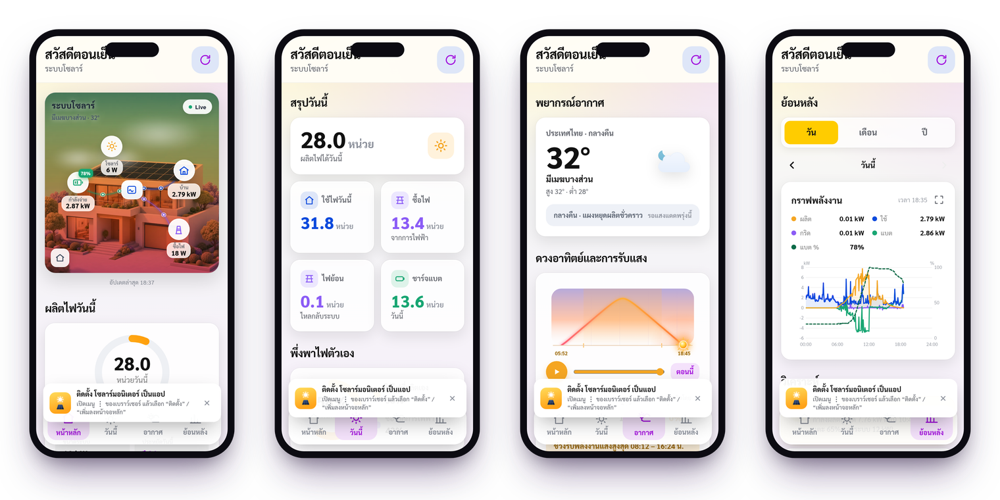</p>

---

## ทำไมต้องใช้

<table>
  <tr>
    <td width="33%" valign="top"><h3>⚡ เห็นสดทุกวินาที</h3>ผังการไหลของพลังงาน โซลาร์ ↔ บ้าน ↔ แบต ↔ กริด จาก <b>Deye Cloud Open API</b> จริง อัปเดตอัตโนมัติ</td>
    <td width="33%" valign="top"><h3>👵 อ่านง่ายทุกวัย</h3>ตัวเลขใหญ่ ปุ่มน้อย ภาษาไทยกระชับ ฟอนต์ Sarabun ออกแบบให้ผู้สูงอายุใช้ได้เอง</td>
    <td width="33%" valign="top"><h3>💸 ฟรีจริง</h3>Cloudflare Workers + D1 free tier ล้วน ไม่มีค่าเซิร์ฟเวอร์รายเดือน deploy ได้ใน 1 คลิก</td>
  </tr>
  <tr>
    <td valign="top"><h3>🧠 วิเคราะห์ให้เอง</h3>พยากรณ์ผลิตไฟที่เรียนรู้จากบ้านคุณ สุขภาพแบต ภาพรวมทั้งปี และคำแนะนำจากตัวเลขจริง (ไม่ใช่ AI เดา)</td>
    <td valign="top"><h3>🔔 แจ้งเตือนเมื่อมีปัญหา</h3>อินเวอร์เตอร์ออฟไลน์ ไฟดับ แบตต่ำ alarm จาก Deye ส่งเข้า Discord / Telegram ได้</td>
    <td valign="top"><h3>🔒 ปลอดภัย</h3>กุญแจ Deye อยู่ฝั่งเซิร์ฟเวอร์เท่านั้น ผู้ใช้เข้าด้วย PIN ไม่ต้องรู้รหัสบัญชี Deye</td>
  </tr>
</table>

---

## ภาพหน้าจอ

<table>
  <tr>
    <td align="center" width="25%">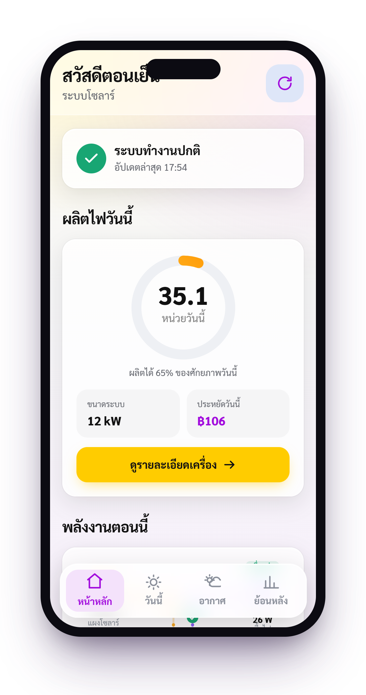<br><b>หน้าหลัก</b><br><sub>สถานะ + ผังพลังงานสด</sub></td>
    <td align="center" width="25%">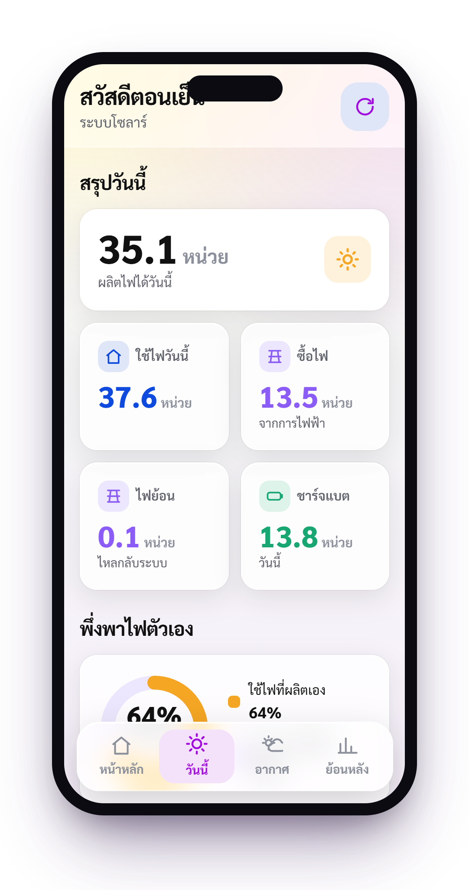<br><b>วันนี้</b><br><sub>ผลิต / ใช้ / ซื้อ / ไฟย้อน</sub></td>
    <td align="center" width="25%">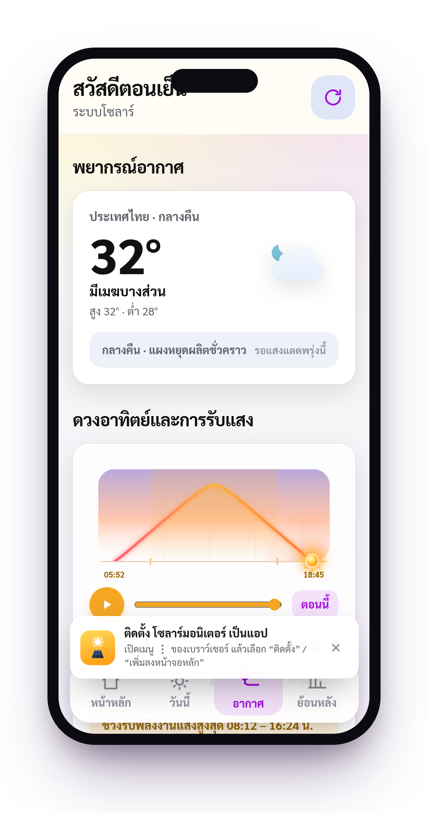<br><b>อากาศ</b><br><sub>พยากรณ์ + ช่วงแดดดีสุด</sub></td>
    <td align="center" width="25%">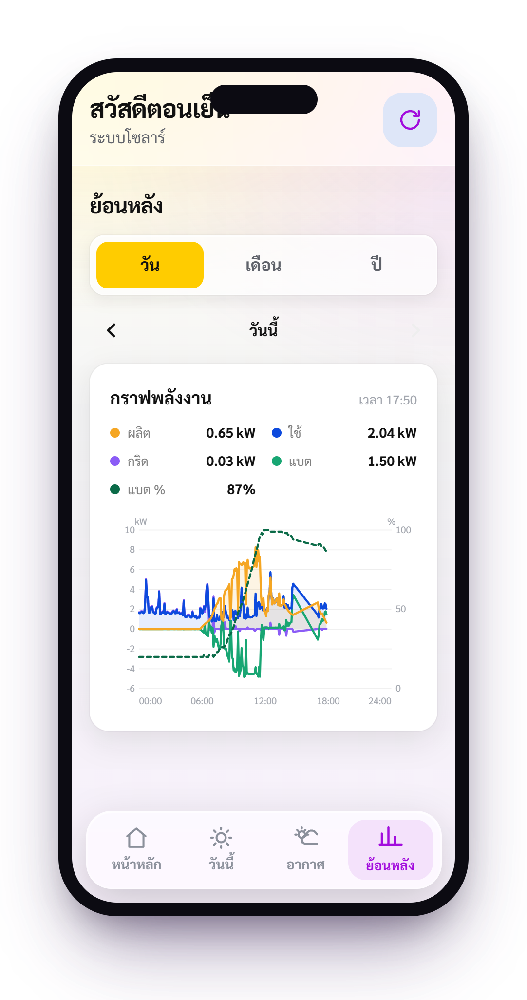<br><b>ย้อนหลัง</b><br><sub>วัน / เดือน / ปี / ตลอด</sub></td>
  </tr>
</table>

**ผังการไหลของพลังงาน — รองรับทุกสถานการณ์จริง**

<table>
  <tr>
    <td align="center">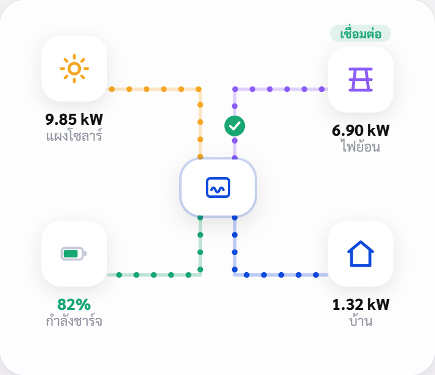<br><sub>กลางวัน · ผลิตเต็ม + ไฟย้อน</sub></td>
    <td align="center">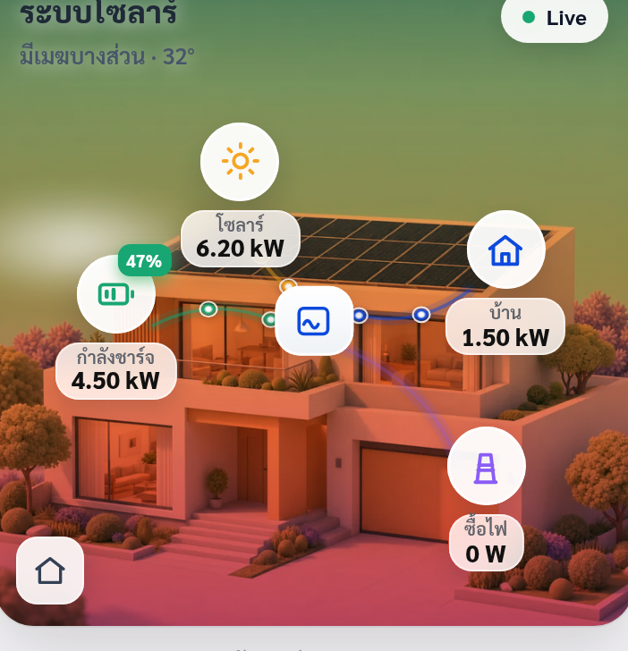<br><sub>แดดดี · กำลังชาร์จแบต</sub></td>
    <td align="center">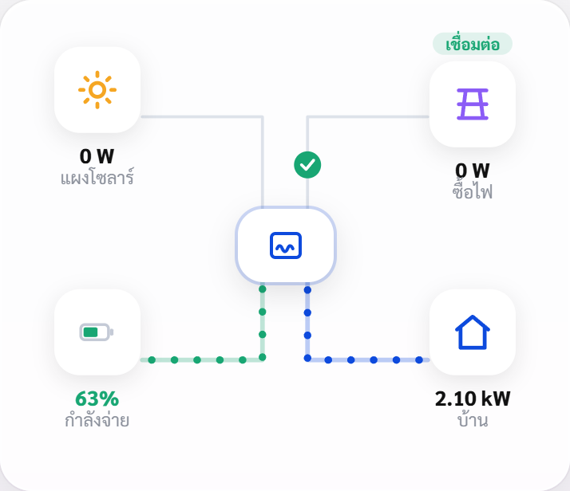<br><sub>ไม่มีแดด · แบตจ่ายไฟ</sub></td>
  </tr>
  <tr>
    <td align="center">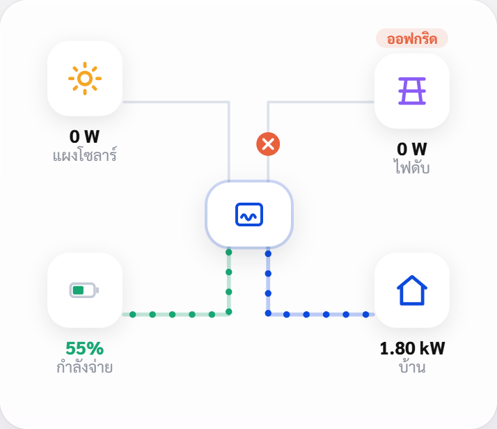<br><sub>ไฟดับ · แบตจ่ายแทนกริด</sub></td>
    <td align="center">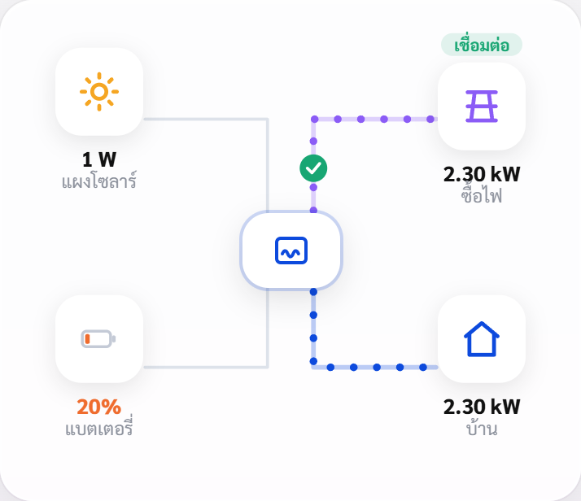<br><sub>กลางคืน · ซื้อไฟจากกริด</sub></td>
    <td align="center">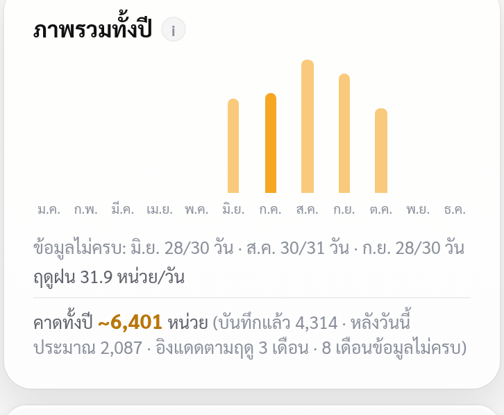<br><sub>ภาพรวมทั้งปี + คาดผลิตทั้งปี</sub></td>
  </tr>
</table>

---

## ฟีเจอร์

### ดูระบบแบบสด
- **หน้าหลัก** — สถานะระบบ (ปกติ/แจ้งเตือน), ผลิตไฟวันนี้, เงินที่ประหยัด, ผังพลังงานเส้นวิ่งตามทิศไฟจริง
- **วันนี้** — สรุปผลิต/ใช้/ซื้อ/ไฟย้อน, สัดส่วนพึ่งพาตัวเอง, การหมุนเวียนพลังงาน · สลับมุมมอง **เต็มวัน** หรือ **รอบแดด เที่ยง→เที่ยง** (เห็นกลางวันกับกลางคืนแยกกัน)
- **รายละเอียดเครื่อง** — ค่าต่อเฟส / PV string / BMS, **alarm จริงจากอินเวอร์เตอร์**, ตรวจสุขภาพระบบ (สมดุลเฟส · ช่องแบต · แรงดัน/ความถี่ · อุณหภูมิ — เงียบเมื่อปกติ), แนวโน้ม 1–90 วัน
- **หลายสถานี** — บัญชีมีหลายระบบ มีตัวสลับบนหัวจอให้เอง

### วิเคราะห์และพยากรณ์
- **พยากรณ์ที่เรียนรู้จากผลจริง** — ขนาดระบบสอบเทียบจากวันแดดดี + ค่าเมฆของบ้านนี้ปรับทุกวันจาก "คาด vs จริง" · การ์ดความแม่นยำพยากรณ์
- **อากาศ** — พยากรณ์ TMD (หรือ Open-Meteo), เส้นทางดวงอาทิตย์ + ช่วงแดดดีสุด, ดัชนี UV, ราย ชม. + 7 วัน
- **สุขภาพแบตเตอรี่ (วัดจริง)** — ความจุใช้ได้จริงจากช่วงคายประจุ, SOH เทียบพิกัด BMS, จำนวนรอบ, ใช้ลึกเฉลี่ย, แนวโน้ม 60 วัน
- **ย้อนหลัง + ภาพรวมทั้งปี** — กราฟราย วัน/เดือน/ปี/ตลอด, เดือนดีสุด/แย่สุด, เทียบปีก่อน, คาดผลิตทั้งปีตามแดดของพิกัดบ้าน
- **คำแนะนำอัตโนมัติ** — คิดจากสมการสมดุลพลังงานของเลขจริง ปรับตามชนิดระบบ on-grid / hybrid / off-grid
- **เทียบ + ส่งออก** — เทียบช่วงก่อนหน้าแบบเวลาเท่ากัน (วันนี้ vs เมื่อวานถึงเวลานี้) · ดาวน์โหลด CSV ทุก 5 นาที / รายวัน / รายเดือน

### ทนทาน ไม่ต้องเฝ้า
- **แจ้งเตือนออกนอกแอป** (ไม่บังคับ) — Discord webhook / Telegram: อินเวอร์เตอร์ออฟไลน์, alarm เกิด/หาย, ไฟกริดหาย, แบตต่ำ, ฟ้าโปร่งแต่ไม่ผลิตไฟ — ส่ง "กลับมาปกติ" ให้ด้วย · ออกแบบให้ **ไม่เตือนมั่ว** (ต้องยืนยันหลายรอบก่อนส่ง)
- **ไม่บันทึกค่าปลอม** — ตัวส่งข้อมูลหลุด / Deye ส่งค่าค้าง ระบบรู้และไม่เก็บซ้ำ · กลับมาแล้ว **เติมข้อมูลย้อนหลังให้เอง**
- **แถบสถานะชัดเจน** — ต่อ Deye ไม่ได้ / ระบบหยุดเก็บ / อินเวอร์เตอร์ไม่ส่งข้อมูล บอกสาเหตุในแอป · `/api/_health` ใช้กับ uptime monitor ได้
- **ติดตั้งเป็นแอป (PWA)** — คำแนะนำติดตั้งปรับตามเครื่อง (Android / iPhone / Mac / อื่นๆ) · ใช้งาน offline ได้

---

## ติดตั้ง (ฟรี)

**ทางที่ 1 — คลิกเดียว:** กดปุ่ม **Deploy to Cloudflare** ด้านบน → Cloudflare สร้าง repo + ฐานข้อมูล D1 และถามค่าลับให้เอง → ได้ลิงก์ `https://deyecloud.<ชื่อคุณ>.workers.dev` เปิดบนมือถือแล้วกด **เพิ่มลงหน้าจอโฮม**

**ทางที่ 2 — คำสั่งเดียว (ใช้ส่วนตัว):**

```bash
npx wrangler login        # ล็อกอิน Cloudflare ครั้งเดียว
cp .dev.vars.example .dev.vars   # ใส่ DEYE_APP_SECRET, DEYE_PASSWORD, APP_PIN, TMD_TOKEN
npm run setup             # สร้าง D1 + ตั้งค่าลับ + build + deploy ให้อัตโนมัติ
```

อัปเดตครั้งต่อไป `npm run deploy` · ดู log `npm run tail` · ตารางใน D1 สร้างเองตอนใช้งานครั้งแรก และ cron เก็บข้อมูลเองทุก 5 นาที — รายละเอียดเต็มใน [`DEPLOY.md`](./DEPLOY.md)

<details>
<summary><b>รันบนเครื่องตัวเอง (สำหรับนักพัฒนา)</b></summary>

```bash
npm install
cp .dev.vars.example .dev.vars   # ใส่ค่าจริง
npm run dev                       # → http://localhost:5174  (มือถือใน LAN: http://<ip>:5174)
```

- ใส่ PIN ที่ตั้งไว้เพื่อเข้า · **cron ไม่ทำงานใน `vite dev`** → เปิด `GET /api/_poll` หนึ่งครั้งเพื่อดึงข้อมูลแรก
- ดูข้อมูลดิบจาก Deye `GET /api/_debug` · ทดสอบหน้าจอด้วยฉากจำลอง `?dev=1` หรือ `?sim=peak`

| คำสั่ง | ทำอะไร |
|---|---|
| `npm run dev` | dev server (port 5174) เสิร์ฟ Worker + หน้าเว็บ |
| `npm run build` | build → `dist/` |
| `npm run typecheck` · `npm test` | ตรวจ type · unit test (Vitest) |
| `npm run setup` | ตั้งค่า + deploy ครั้งแรกอัตโนมัติ |
| `npm run deploy` | build + deploy ขึ้น Cloudflare |
| `npm run db:create` / `db:init` | สร้าง / ตั้งตาราง D1 แบบ manual (ปกติ `setup` ทำให้แล้ว) |
| `npm run tail` | ดู log production |
| `node design/mockup.mjs` | ถ่ายภาพหน้าจอ + กรอบมือถือ → `docs/shots/` (ใช้กับเครื่องที่ deploy แล้วได้ด้วย `BASE=… PIN=…`) |

</details>

---

## ตั้งค่า

ตั้งน้อยที่สุด — **สถานี พิกัด กำลังติดตั้ง สถานที่ ดึงจาก Deye เองแล้วเก็บไว้** ไม่มีค่าส่วนตัวฝังในโค้ด · ค่าไฟ / ค่าขายคืน / ทุนติดตั้ง / CO₂ ตั้งในแอป (แท็บ "ตลอด" → ตั้งค่า)

| ต้องตั้ง | ที่มา |
|---|---|
| `DEYE_APP_ID`, `DEYE_EMAIL` | จาก [developer.deyecloud.com](https://developer.deyecloud.com) (ตั้งตอน deploy) |
| `DEYE_APP_SECRET`, `DEYE_PASSWORD` | **ค่าลับ** — `.dev.vars` (เครื่องตัวเอง) / `wrangler secret` (production) |
| `APP_PIN` | PIN เข้าแอป · ไม่ตั้ง = ดูได้สาธารณะ แต่หน้าผู้ดูแล `/api/_*` จะปิด |

<details>
<summary><b>ค่าเสริมทั้งหมด (ไม่ตั้งก็ใช้ได้)</b></summary>

| ตัวแปร | ใช้ทำอะไร |
|---|---|
| `DEYE_BASE_URL` | ค่าตั้งต้น EU (`eu1-developer…`) — เปลี่ยนเป็น us1 ถ้าบัญชีอยู่ US |
| `DEYE_STATION_ID` · `DEYE_COMPANY_ID` | ปักสถานีเจาะจง / company ของบัญชี |
| `TMD_TOKEN` · `TMD_BASE` | พยากรณ์อากาศกรมอุตุฯ (ไม่ตั้ง = ใช้ Open-Meteo) |
| `WEATHER_LAT` / `WEATHER_LON` / `WEATHER_PLACE` | ปรับพิกัดอากาศเอง |
| `ALERT_WEBHOOK_URL` · `TELEGRAM_BOT_TOKEN` + `TELEGRAM_CHAT_ID` | ช่องทางแจ้งเตือน |
| `ALERT_SOC_MIN` · `ALERT_REPEAT_MIN` · `ALERT_MUTE` · `ALERT_HEURISTICS` | เกณฑ์แบตต่ำ · เตือนซ้ำทุกกี่นาที (360) · ปิดรายกติกา · ส่งคำแนะนำเชิงวิเคราะห์ออกนอกแอปด้วย |
| `GRID_NOMINAL_V` / `GRID_NOMINAL_HZ` | แรงดัน/ความถี่ปกติของไซต์ (เช่น 230/50) — ไม่ตั้ง = ไม่เช็คค่าสัมบูรณ์ (จงใจไม่เดา) |
| `CONTACT_EMAIL` | อีเมลติดต่อที่แนบไปกับการค้นชื่อสถานที่ (OpenStreetMap ขอให้ระบุ) |

</details>

---

## สถาปัตยกรรมโดยย่อ

```
มือถือ (PWA) ─▶ Cloudflare Worker ─┬─▶ Deye Cloud Open API  (สด + ย้อนหลัง + อุปกรณ์ + alarm)
  เข้าด้วย PIN    หน้าเว็บ + /api/*   ├─▶ D1 (SQLite)          (ประวัติ + cache + token)
                  cron ทุก 5 นาที    └─▶ TMD / Open-Meteo     (อากาศ + UV ตามพิกัดสถานี)
```

ทุกอย่างอยู่ใน Worker เดียว · ค่าลับไม่ออกไปฝั่งมือถือ · การรับแดด (ขึ้น-ตก, ช่วงแดดดี, ชั่วโมงแดดเต็ม) คำนวณจริงด้วย NOAA + Haurwitz · โควต้าต่อรอบของ free tier ถูกคิดไว้ในโค้ด (cron วันละ 288 ครั้ง ห่างลิมิต 100,000 req/วันมาก)

**Stack:** Vite 6 · React 19 · TypeScript · Tailwind CSS v4 · Hono 4 · Cloudflare Workers / D1 / Cron / Static Assets · vite-plugin-pwa · Vitest · Meteocons

<details>
<summary><b>ดีไซน์</b></summary>

ธีม **Solurna**: เหลือง `#FFCC00` (ปุ่ม) + ม่วง `#A20DDD` (เมนูที่เลือก) บนพื้น gradient แสงเช้า · พื้นผิวกระจกฝ้าแบบ iOS (`.glass-card`) + พื้นทึบสำหรับกราฟ/ตัวเลขใหญ่ (`.metric-plate`) — token รวมที่ `src/lib/ui.ts`

**สีพลังงาน (เหมือนกันทั้งแอป):** โซลาร์ เหลือง `#f5a623` · บ้าน น้ำเงิน `#0d4add` · กริด ม่วง `#8b5cf6` · แบต เขียว `#18a673`

**เพื่อผู้สูงอายุ:** เมนู 4 ปุ่ม · ตัวอักษร ≥14px ตัวเลขใหญ่ · เคารพ `prefers-reduced-motion` · ไอคอนเส้น ไม่ใช้ emoji ในแอป · บ้านในหน้าหลักวาดด้วย SVG เอง

</details>

---

<p align="center">
  สร้างด้วย ❤️ บน <b>Cloudflare Workers</b> ·
  <a href="./ARCHITECTURE.md">ARCHITECTURE.md</a> ·
  <a href="./DEPLOY.md">DEPLOY.md</a>
</p>
